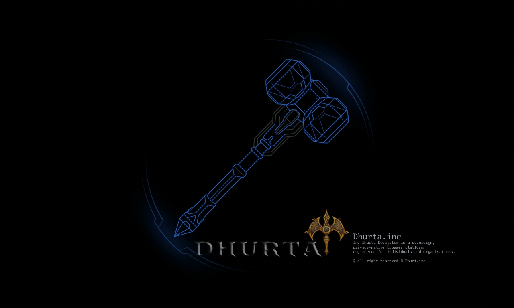

<!-- Dhurta — README · © Dhurta.inc -->

<div align="center">



<br/>

<!-- Badges -->


### **A sovereign, privacy-native browser.**
*Your data never leaves your machine — no telemetry, no cloud, no compromise.*

[**⬇ Download**](https://github.com/prashantkeshr/Dhurta/releases) ·
[**✨ Features**](#-features) ·
[**🚀 Install**](#-installation) ·
[**🖥 Usage**](#-usage-guide) ·
[**❓ Troubleshooting**](#-troubleshooting) ·
[**💬 Feedback**](#-feedback--improvements)

</div>

---

## 🌌 What is Dhurta?

**Dhurta** is a desktop browser built by **Dhurta.inc** for people and organisations
who treat digital surveillance as an unacceptable operating condition. Privacy
isn't a setting you switch on — it's the foundation. Zero telemetry. Zero cloud
dependency. Every byte you generate stays sovereign, under your control.

<div align="center">

</div>

---

## ✨ Features

| | Feature | What it does |
|---|---|---|
| 🛡️ | **Chakra Shield** | One tap enables VPN + Anti-Fingerprint + WebRTC Block + Cookie Guard + Ad Blocker + Auto-Clean. Animated only when **all** protections are live. |
| 👻 | **Ghost Mode** | In-memory ephemeral session, fingerprint spoofing, WebRTC fully blocked, and all traffic routed through the **Tor** onion network. |
| 🧿 | **Omni Dashboard** | Live privacy audit: public IP vs. real IP, blocked-tracker count, fingerprint surface, and every shield's status on one screen. |
| 🌫️ | **Anti-Fingerprint Engine** | Spoofs screen, hardware, WebGL, canvas, audio, timezone, and client-hints so every Dhurta user presents one uniform anonymity set. |
| 🚫 | **WebRTC Leak Guard** | Dismantles the WebRTC APIs that leak your real IP even behind a VPN. |
| 🌉 | **Dhurta Setu** | Built-in curated web index and information bridge. |
| 🔗 | **Dhurta Connect** | Zero-server, end-to-end encrypted P2P chat, voice/video calls, and file sharing — pair by a short numeric code. |
| 🔒 | **Real-time Breach Warnings** | If any protection drops, a warning banner appears instantly under the address bar with a one-click fix. |

---

## 🚀 Installation

> [!TIP]
> Grab the latest official build from the **[Releases page](https://github.com/prashantkeshr/Dhurta/releases)**.

### 🪟 Windows
1. Download **`Dhurta-Setup-1.0.8.exe`**.
2. Double-click it. Because the build isn't code-signed yet, Windows SmartScreen
   may show *"Windows protected your PC"* → click **More info → Run anyway**.
3. Choose an install folder, finish, and launch from the **Dhurta Browser**
   shortcut on your Desktop / Start Menu.

### 🍎 macOS
1. Download **`Dhurta-1.0.8.dmg`**, open it, drag **Dhurta** to Applications.
2. First launch: right-click → **Open** (unsigned build) to bypass Gatekeeper.

### 🐧 Linux
```bash
# AppImage (portable)
chmod +x Dhurta-1.0.8.AppImage && ./Dhurta-1.0.8.AppImage
# or Debian/Ubuntu
sudo dpkg -i dhurta_1.0.8_amd64.deb
```

---

## 🖥 Usage Guide

**First run — get protected in 10 seconds:**

1. **Enable Chakra Shield** — click the spinning-wheel **Chakra** icon in the left
   sidebar. It connects the VPN, anti-fingerprint, and WebRTC block together. The
   icon animates once all three confirm.
2. **Or go fully dark with Ghost Mode** — click the **Trishula** logo at the top of
   the sidebar. In-memory session + Tor routing. The sidebar glows red when active.
3. **Verify** — open the **Omni** dashboard (shield-with-dot icon) and confirm your
   **Public IP differs from your Real IP** and the blocked-tracker count is rising.
4. **Explore the ecosystem** — **Setu** and **Connect** live in the Home-tab
   Favourites dock.

> Ghost Mode and Chakra Shield are mutually exclusive — activating one gracefully
> turns off the other.

---

## 🧩 Building from source

> [!IMPORTANT]
> Building is permitted for the Owner and explicitly authorized contributors only
> (see [License](#-license--legal)).

```bash
git clone https://github.com/prashantkeshr/Dhurta.git
cd Dhurta
npm install --legacy-peer-deps      # workspace peer-resolution
npm run dev                          # launches Vite + Electron

# Production installer
npm run build                        # → release/Dhurta-Setup-1.0.8.exe
```

**Monorepo layout**

```
Dhurta/
├── electron/     · main process, IPC, tool registry
├── src/          · React browser UI
├── packages/     · @dhurta/core (privacy engine), ui, mobile, connect-pwa
└── tools/        · setu · connect  (the bundled ecosystem tools)
```

---

## ❓ Troubleshooting

<details>
<summary><b>"Windows protected your PC" warning on install</b></summary>

Expected for unsigned builds. Click **More info → Run anyway**. Code signing is
planned for a future release.
</details>

<details>
<summary><b>The Dhurta logo or Chakra icon doesn't appear</b></summary>

Make sure you're on the latest build — an earlier version had an asset-path bug in
the packaged app. Re-download the newest `Dhurta-Setup-1.0.8.exe` and reinstall.
</details>

<details>
<summary><b>Chakra Shield won't turn on / stays idle</b></summary>

Chakra requires a working VPN connection plus anti-fingerprint and WebRTC block.
If the VPN can't connect, the shield stays idle and a **security-breach banner**
appears under the address bar with a one-click fix. Check your network allows
outbound VPN connections.
</details>

<details>
<summary><b>Setu or Connect won't open</b></summary>

They ship bundled inside the installer. If you built from source, keep the
`tools/setu` and `tools/connect` folders in place, or set `DHURTA_TOOL_SETU_ROOT`
/ `DHURTA_TOOL_CONNECT_ROOT` to their locations.
</details>

<details>
<summary><b>Ghost Mode is slow to connect</b></summary>

First Tor bootstrap can take 10–30 seconds. If Tor is unavailable on your
platform, Ghost Mode falls back to a direct in-memory session (still fingerprint-
spoofed and WebRTC-blocked).
</details>

---

## 💬 Feedback & Improvements

Your feedback shapes Dhurta. 🙏

- 🐛 **Found a bug?** [Open an issue](https://github.com/prashantkeshr/Dhurta/issues/new) — include your OS, what you did, what you expected, and what happened.
- 💡 **Have an idea?** Open an issue describing the improvement. Ideas are always welcome (implementation requires authorization — see below).
- ⭐ **Like Dhurta?** Star the repo — it genuinely helps.

---

## 🤝 Contributing

> [!IMPORTANT]
> **Dhurta is proprietary.** Every change — code, assets, docs, or config —
> requires the **prior written authorization of the Owner** (Prashant Keshri,
> Dhurta.inc). Pull requests are *proposals only* and become part of Dhurta solely
> after the Owner reviews, approves, and merges them.

Read **[CONTRIBUTING.md](CONTRIBUTING.md)** for the full process. Reporting bugs and
suggesting ideas never needs prior authorization — implementing changes does.

---

## ⚖️ License & Legal

**Copyright © 2026 Dhurta.inc. All Rights Reserved.**

Dhurta is proprietary software governed by a custom license — see **[LICENSE](LICENSE)**.
No copying, modification, redistribution, or derivative work is permitted without
the **Owner's prior written authorization**.

The Software incorporates open-source components (Electron, React, Chromium,
better-sqlite3, Tor, and others) that remain under their own respective licenses.
Full third-party notices and formal regulatory/legal compliance will be finalized
in a later revision.

*Dhurta, Dhurta.inc, and the Dhurta trishula mark are trademarks of Dhurta.inc.*

<div align="center">
<br/>

**Built with conviction by [Dhurta.inc](https://github.com/prashantkeshr)**

*Sovereign · Privacy-Native · Yours*

`© 2026 Dhurta.inc — All Rights Reserved`

</div>
