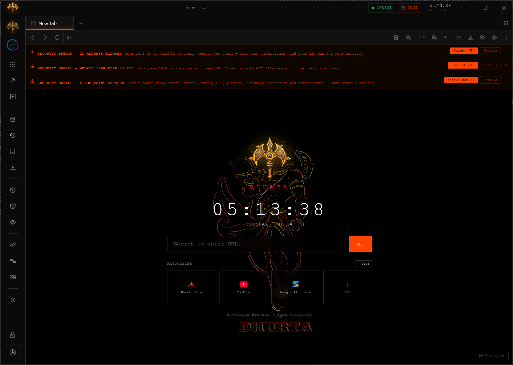
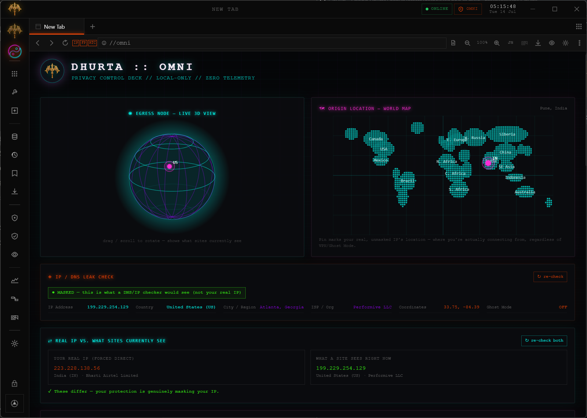

<!-- Dhurta — README · © 2026 Dhurta.inc · All Rights Reserved -->

<div align="center">


<br/>

<!-- Core badges -->


<!-- Tech stack -->


### 🔱 **A sovereign, privacy-native browser.**
*Your data never leaves your machine — no telemetry, no cloud, no compromise.*

[**⬇ Download**](https://github.com/prashantkeshr/Dhurta/releases) ·
[**✨ Features**](#-features) ·
[**🚀 Install**](#-installation) ·
[**🖥 Usage**](#-usage-guide) ·
[**🎁 Contribute & Win Goodies**](#-contributing--win-goodies) ·
[**❓ Troubleshooting**](#-troubleshooting) ·
[**💬 Feedback**](#-feedback--improvements)

</div>

---

## 🌌 What is Dhurta?

**🔱 Dhurta** is a desktop browser engineered by **Dhurta.inc** for people and organisations
who treat digital surveillance as an unacceptable operating condition.

Privacy isn't a setting you switch on — it's the foundation the entire browser is built on.
Zero telemetry. Zero cloud sync. Zero tracking. Every byte you generate stays sovereign,
under your control, on your machine.

> *"The Trishula 🔱 is our mark — three prongs of sovereignty, privacy, and control."*

---

## 🖥 Live Browser Dashboard

> A real screenshot of Dhurta in action — the home tab with the 🔱 trishula mark, real-time security breach detection, and the Dhurta.inc favourites dock.

<div align="center">

</div>

*The three orange banners demonstrate Dhurta's real-time security breach detection — the moment a protection is inactive, you're told exactly what is exposed and given a one-click fix.*

---

## ✨ Features

| 🔱 | Feature | What it does |
|---|---|---|
| 🛡️ | **Chakra Shield** | One tap enables VPN + Anti-Fingerprint + WebRTC Block + Cookie Guard + Ad Blocker + Auto-Clean. Activates only when **all** protections confirm. |
| 👻 | **Ghost Mode** | Ephemeral in-memory session, fingerprint spoofing, WebRTC fully blocked, all traffic routed through the **Tor** onion network. Sidebar glows red when active. |
| 🧿 | **Omni Dashboard** | Live privacy audit: public IP vs. real IP, blocked-tracker count, fingerprint surface, every shield's live status. |
| ⚠️ | **Breach Detection** | If any protection drops mid-session, a red banner fires instantly below the address bar with a one-click fix — no protection silently fails. |
| 🌫️ | **Anti-Fingerprint Engine** | Spoofs screen, hardware, WebGL, canvas, audio, timezone, and client-hints so every 🔱 Dhurta user presents one uniform anonymity set. |
| 🚫 | **WebRTC Leak Guard** | Completely dismantles the WebRTC APIs that leak your real IP even behind a VPN. |
| 🌉 | **Dhurta Setu** | Built-in curated web index and information bridge — your first-party search. |
| 🔗 | **Dhurta Connect** | Zero-server, end-to-end encrypted P2P chat, voice/video calls, and file sharing. Pair with a short numeric code — no accounts, no servers. |
| 🔒 | **Lock Screen** | PIN-protected session lock — walk away from your machine without fear. |

---

## 🔍 Don't Trust Us — Verify Us

A privacy product that asks for blind faith isn't a privacy product. Dhurta is built so you can **audit its claims yourself, from inside the browser, in under five minutes**:

1. **Watch every request leave the browser.** Open **Omni → Live Request Feed** (`dhurta://omni`). Every GET/POST the active tab makes is listed live, with its destination. Browse for an hour — you will find **zero** requests to any Dhurta server, because none exist. There is no Dhurta server.
2. **Check what's leaving beyond the page you're on.** Omni's **"Other Data Leaving This Browser"** panel splits every destination into first-party vs. third-party, so you can see exactly who else learned about your visit.
3. **Verify the IP masking is real, not a UI label.** Omni runs a live **Real IP vs. What Sites See** comparison — two independent lookups, one forced direct and one through your active protection. If they match, Dhurta *tells you you're exposed* instead of showing a comforting green badge.
4. **Scan your own fingerprint.** Omni's **Fingerprint Surface Scanner** shows the exact screen size, GPU string, core count, timezone, and languages the current tab is presenting to websites — so you can confirm the spoofing with your own eyes.
5. **Go external.** Run [Wireshark](https://www.wireshark.org/) against the Dhurta process, or test at `browserleaks.com` / `coveryourtracks.eff.org` with Ghost Mode on. We encourage it.

> 🔱 **Zero telemetry isn't a promise. It's an architecture.** The codebase contains no analytics SDK, no crash reporter that phones home, no update pings beyond checking the public GitHub Releases feed.

<details>
<summary><b>❓ "It's proprietary — why should I trust a closed-source privacy browser?"</b></summary>
<br/>

A fair question, and we won't dodge it. Three answers:

1. **The claims above are verifiable without source access.** Network traffic doesn't lie — the Live Request Feed, Wireshark, and external leak-test sites let you confirm the zero-telemetry and IP-masking claims empirically, which is stronger evidence than source code you'd never compile yourself anyway.
2. **A named, accountable human stands behind it** (see [Governance](#%EF%B8%8F-legal-license--governance)) — not an anonymous team that can vanish.
3. **Source-available auditing is on the roadmap.** As the project matures, we intend to open the security-critical modules (network layer, fingerprint engine) for independent review. A young product protecting its work and a product hiding something are not the same thing — and until you can read the code, we've made sure you can read the traffic.

</details>

---

## 🎯 Threat Model — What Dhurta Protects You From (and What It Can't)

Honest security tools state their boundaries. Here are ours.

**Dhurta protects you against:**

| Adversary | How |
|---|---|
| **Trackers & ad networks** | Ad/tracker blocking, Cookie Guard, Auto-Clean, third-party visibility in Omni |
| **Browser fingerprinting** | Uniform anonymity set: spoofed screen/GPU/cores/RAM/canvas/audio/timezone on every tab |
| **Sites learning your real IP** | VPN proxy rail (Chakra) or real Tor onion routing (Ghost), with WebRTC leak APIs dismantled |
| **Your ISP logging your browsing** | Ghost Mode: the ISP sees only an encrypted Tor connection, never your destinations |
| **Silent protection failure** | Fail-closed kill switch — if the VPN drops mid-connect, traffic is **blocked**, never silently leaked. Breach banners fire the moment any shield goes down |
| **Someone at your machine** | PIN lock screen, in-memory Ghost sessions that leave nothing on disk |

**Dhurta does NOT protect you against:**

- **A nation-state targeting you personally.** If that's your threat model, use the [Tor Browser](https://www.torproject.org/) on Tails — and we say that without ego.
- **Malware already on your machine.** No browser can defend a compromised OS.
- **What you log into.** If you sign into an account, that site knows who you are regardless of IP masking.
- **Free-proxy operators seeing Chakra-mode traffic.** Chakra's VPN rail uses community proxies (see limitations below) — for maximum-stakes browsing, use Ghost Mode's Tor routing instead.

---

## ⚠️ Honest Limitations

Every privacy product has trade-offs. Vendors that hide theirs are selling you something. Ours, plainly:

- **The free VPN uses community proxy servers.** They can be slow, go offline mid-session, or get overloaded — this is the inherent nature of free public proxies, not a bug. Dhurta compensates by health-checking every proxy before trusting it, failing closed when one dies, and offering one-click server switching the moment a page struggles. For sensitive work, Ghost Mode's Tor routing is the stronger rail.
- **Ghost Mode is slower than normal browsing.** That's Tor — your traffic hops through three volunteer relays across the planet. It's the cost of genuine anonymity, and we won't pretend otherwise.
- **Builds are currently unsigned.** Windows SmartScreen and macOS Gatekeeper will warn you. Code-signing certificates cost money a young project spends carefully; signing is on the roadmap. Until then, every release ships SHA-256 checksums so you can verify your download came from us.
- **Some sites break under heavy protection.** Canvas noise can affect DRM video; WebRTC blocking kills some video-call sites. Every shield is individually toggleable, and breach banners tell you exactly what's on or off — the choice stays yours.
- **Windows is the primary tested platform today.** macOS and Linux builds exist but receive less testing. Report what breaks — issues get read.

---

## ⚖️ How Dhurta Compares — Honestly

| | 🔱 Dhurta | Brave | Firefox | Tor Browser |
|---|---|---|---|---|
| Zero telemetry by default | ✅ none exists | ⚠️ opt-out analytics | ⚠️ opt-out telemetry | ✅ |
| Built-in real Tor routing | ✅ Ghost Mode | ⚠️ Tor windows (no fingerprint uniformity) | ❌ | ✅ its entire purpose |
| Built-in free VPN rail | ✅ with fail-closed kill switch | ⚠️ paid | ❌ | n/a |
| Live self-audit dashboard (see your IP, fingerprint, every request) | ✅ Omni | ❌ | ❌ | ❌ |
| Fingerprint spoofing to a uniform set | ✅ | ⚠️ randomization | ⚠️ partial (RFP off by default) | ✅ strongest |
| Extension ecosystem | ⚠️ Chrome extensions, young | ✅ mature | ✅ mature | ⚠️ discouraged |
| Track record & audits | ⚠️ new project, unaudited | ✅ established | ✅ established | ✅ established |
| Speed on Tor-free browsing | ✅ full speed | ✅ | ✅ | ❌ always Tor |

**Bottom line:** established browsers have the track record we haven't earned yet — what Dhurta offers that none of them do is the combination of *verifiable* zero-telemetry, real Tor + VPN rails in one browser, and a dashboard that shows you the truth about your own exposure instead of asking you to assume it.

---

## 🚀 Installation

> [!TIP]
> Always download from the **[official Releases page](https://github.com/prashantkeshr/Dhurta/releases)** — official, verified builds only.

### 🪟 Windows
1. Download **`Dhurta-Setup-1.2.0.exe`** from Releases.
2. **Verify the download** — compare its SHA-256 hash against the checksum published in the release notes:
   ```powershell
   Get-FileHash .\Dhurta-Setup-1.2.0.exe -Algorithm SHA256
   ```
3. Double-click to install. Windows SmartScreen may show *"Windows protected your PC"* for unsigned builds → click **More info → Run anyway**. *(Why this happens is explained honestly in [Known Limitations](#-honest-limitations) below.)*
4. Launch **🔱 Dhurta Browser** from your Desktop or Start Menu.

### 🍎 macOS
1. Download **`Dhurta-1.2.0.dmg`**, open, drag **Dhurta** to Applications.
2. First launch: right-click the app → **Open** to bypass Gatekeeper on unsigned builds.

### 🐧 Linux
```bash
# AppImage (portable — works on any distro)
chmod +x Dhurta-1.2.0.AppImage && ./Dhurta-1.2.0.AppImage

# Debian / Ubuntu
sudo dpkg -i dhurta_1.2.0_amd64.deb
```

---

## 🖥 Usage Guide

### Getting protected in 30 seconds

```
1. Launch 🔱 Dhurta
2. Click the Chakra wheel icon (sidebar) → connects VPN + Anti-FP + WebRTC block
3. OR click the trishula logo → Ghost Mode (full Tor routing + ephemeral session)
4. Open Omni (shield icon) → confirm Public IP ≠ Real IP
5. Browse. Nothing is logged. Nothing leaves your machine.
```

### The sidebar — your privacy command centre

| Icon | Function |
|------|----------|
| 🔱 Trishula | Toggle Ghost Mode (Tor + ephemeral + full anonymity) |
| ⚙️ Chakra wheel | Toggle Chakra Shield (all-in-one privacy stack) |
| 🏠 Home | New Tab / Home dashboard |
| 🕐 History | Session history (cleared on Ghost Mode) |
| 🔖 Bookmarks | Your saved sites |
| ⬇ Downloads | Download manager |
| 🧿 Omni | Live privacy dashboard |
| 📈 Stats | Tracker block stats |
| 🌉 Connect | Dhurta Connect P2P tool |
| ⚙️ Settings | Full browser settings |
| 🔒 Lock | PIN lock the session |

### Dhurta Omni Dashboard Unified place for Network detection.
DHURTA :: OMNI

<div align="center">

</div>
Dhurta Browser — real Network protection dashboard screenshot showing the Real time security Survilance, security breach warnings, and other security feature with & Network overview

### Security Breach Banners

When Dhurta detects an unprotected state, it fires a **real-time warning banner** below the address bar:

- 🔴 **IP ADDRESS EXPOSED** — your real IP is visible; click `Connect VPN`
- 🔴 **WEBRTC LEAK RISK** — WebRTC APIs can bypass VPN; click `Block WebRTC`
- 🔴 **FINGERPRINT EXPOSED** — your browser is uniquely identifiable; click `Enable Anti-FP`

Each banner has a one-click fix and a **Details** button for a full explanation.

---

## 🧩 Building from Source

> [!IMPORTANT]
> Building is authorized for the Owner and explicitly approved contributors only — see [CONTRIBUTING.md](CONTRIBUTING.md) and [LICENSE](LICENSE).

```bash
git clone https://github.com/prashantkeshr/Dhurta.git
cd Dhurta
npm install --legacy-peer-deps   # workspace peer-resolution required
npm run dev                       # Vite + Electron dev mode

# Production build
npm run build:renderer            # compile React UI
npm run build:electron            # compile main process + @dhurta/core
npx electron-builder              # → release/Dhurta-Setup-1.0.8.exe
```

**Monorepo layout**

```
🔱 Dhurta/
├── electron/          main process · IPC · tool registry · preload
├── src/               React browser UI (frameless Electron window)
├── packages/
│   ├── core/          @dhurta/core — privacy engine (fingerprint, WebRTC, blocklist, IPC)
│   ├── ui/            shared UI components
│   ├── mobile/        Android/iOS expansion (roadmap)
│   └── connect-pwa/   Dhurta Connect PWA wrapper
└── tools/
    ├── setu/          🌉 Dhurta Setu — bundled web index tool
    └── connect/       🔗 Dhurta Connect — P2P comms tool
```

---

## 🎁 Contributing & Win Goodies

> [!NOTE]
> 🔱 **Dhurta welcomes you!** — we are actively building a community of privacy-first contributors.

**Major contributions are rewarded with exciting goodies:**

| Tier | What qualifies | Reward |
|---|---|---|
| 🥉 Explorer | First accepted bug report or doc fix | Shoutout + Explorer badge |
| 🥈 Builder | Accepted feature or significant fix | 🔱 Digital swag pack + Builder badge + AUTHORS listing |
| 🥇 Architect | Major feature, security improvement, platform port | Merchandise + Architect badge + credit in app About screen |
| 👑 Legend | Transformative contribution | Direct Owner collaboration + exclusive 🔱 Legend kit + release credits |

**How to contribute:**
1. [Open an issue](https://github.com/prashantkeshr/Dhurta/issues/new) describing your idea or bug
2. Wait for Owner authorization (required for all code changes)
3. Implement & submit a PR
4. Win 🎁

Read **[CONTRIBUTING.md](CONTRIBUTING.md)** for the full process, security disclosure policy, and legal terms.

> Bug reports and feature ideas **never** need prior authorization — only implementation does.

---

## ❓ Troubleshooting

<details>
<summary><b>🪟 "Windows protected your PC" on install</b></summary>

Expected for unsigned builds. Click **More info → Run anyway**. Code signing is planned for a future release. Only download from the [official Releases page](https://github.com/prashantkeshr/Dhurta/releases).
</details>

<details>
<summary><b>🔱 The Dhurta logo or Chakra icon is missing</b></summary>

You may be on an older build with an asset-path bug. Re-download the latest `Dhurta-Setup-1.0.8.exe` and reinstall — this was fixed in v1.0.8.
</details>

<details>
<summary><b>🛡️ Chakra Shield won't activate</b></summary>

Chakra requires **all three** of: VPN connected + Anti-Fingerprint enabled + WebRTC blocked. If the VPN fails to connect, the shield stays idle and the breach banners appear. Check that your network allows outbound VPN connections (port 1194/UDP or 443/TCP).
</details>

<details>
<summary><b>👻 Ghost Mode is slow or fails to connect</b></summary>

First Tor bootstrap takes 10–30 seconds. On networks that block Tor directly, it may time out — try using a Tor bridge (settings → Ghost Mode → Configure Bridge). Without Tor, Ghost Mode falls back to an in-memory session (still fingerprint-spoofed and WebRTC-blocked, but not Tor-routed).
</details>

<details>
<summary><b>🌉 Setu or 🔗 Connect won't open</b></summary>

They ship bundled inside the official installer. If you built from source, confirm the `tools/setu` and `tools/connect` directories exist in the repo root. You can override paths with env vars `DHURTA_TOOL_SETU_ROOT` and `DHURTA_TOOL_CONNECT_ROOT`.
</details>

<details>
<summary><b>📦 Installation fails or app won't start</b></summary>

1. Confirm you're on Windows 10 64-bit or later (macOS 12+, Ubuntu 20.04+).
2. Uninstall any existing Dhurta version first.
3. Run the installer as Administrator if on a managed machine.
4. If the app crashes on startup, open an [issue](https://github.com/prashantkeshr/Dhurta/issues/new) with the error from `%LOCALAPPDATA%\Dhurta\logs\main.log`.
</details>

---

## 💬 Feedback & Improvements

Your feedback is the most important signal Dhurta has. 🔱 🙏

| Channel | Use it for |
|---|---|
| [🐛 Open a bug report](https://github.com/prashantkeshr/Dhurta/issues/new) | Crashes, missing features, unexpected behaviour |
| [💡 Open a feature request](https://github.com/prashantkeshr/Dhurta/issues/new) | Ideas for new privacy features or UX improvements |
| [⭐ Star the repo](https://github.com/prashantkeshr/Dhurta) | Show support — every star helps Dhurta grow |
| [🔱 Contribute](CONTRIBUTING.md) | Code, design, docs, translations, testing |

Include in bug reports: **OS · version · steps to reproduce · expected vs. actual behaviour · screenshots/logs.**

---

## ⚖️ Legal, License & Governance

<details>
<summary><b>📜 License</b></summary>

**Copyright © 2026 Dhurta.inc. All Rights Reserved.**

🔱 Dhurta is **proprietary software**. No copying, modification, redistribution, reverse-engineering, or derivative works are permitted without the **Owner's prior written authorization**.

See **[LICENSE](LICENSE)** for the full terms.

</details>

<details>
<summary><b>🏛️ Governance</b></summary>

- **Owner & sole authorized approver:** Prashant Keshri (Dhurta.inc)
- **All changes** — code, assets, docs, config, releases — require Owner authorization before merging
- **Contribution authorization** must be obtained via a GitHub issue before implementation begins
- **Pull requests** are proposals only; they become part of Dhurta only after Owner review, approval, and merge
- **Release decisions** (versioning, platform support, feature scope) rest solely with the Owner

</details>

<details>
<summary><b>🧩 Third-party components</b></summary>

Dhurta incorporates open-source components including Electron, React, Chromium (via Electron), better-sqlite3, the Tor network client, and the Cliqz adblocker engine. Each component remains under its own respective license. Those licenses govern only their respective components and do not extend to Dhurta as a whole.

A full third-party notice (`NOTICE`) will be published as the project matures toward a formal commercial release.

</details>

<details>
<summary><b>™️ Trademarks</b></summary>

**"Dhurta"**, **"Dhurta.inc"**, the **🔱 trishula mark**, and related logos are trademarks of Dhurta.inc. No trademark rights are granted by the software license or by contributing to this project.

</details>

<details>
<summary><b>🔐 Privacy of the browser itself</b></summary>

Dhurta collects **zero telemetry**. No usage data, crash reports, browsing history, or analytics are ever transmitted anywhere. The browser operates entirely offline from Dhurta.inc's perspective. Tor integration is handled by the bundled Tor client — Dhurta.inc never sees your traffic.

</details>

---

<div align="center">
<br/>


**Built with conviction by [Dhurta.inc](https://github.com/prashantkeshr)**

*🔱 Sovereign · Privacy-Native · Yours*

`© 2026 Dhurta.inc — All Rights Reserved`

</div>
